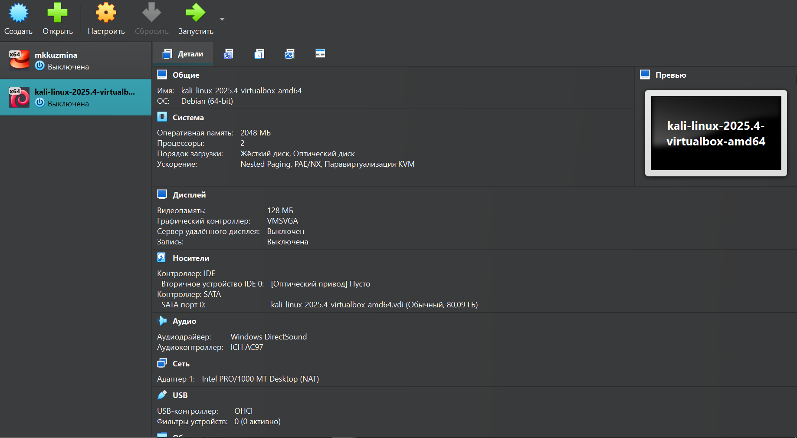
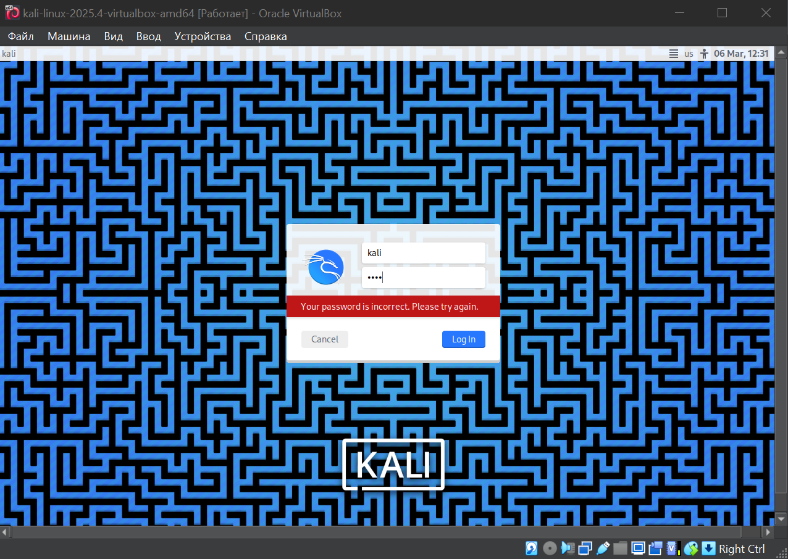

---
author:
  - name: "Кузьмина Мария Константиновна"
title: "Индивидуальный проект №1"
subtitle: "Основы информационной безопасности"
format: 
  revealjs:
    theme: simple
    transition: slide
    slide-number: true
    center: true
    chalkboard: true
    menu: true
  beamer:
    pdf-engine: lualatex
    aspectratio: 169
    slide-level: 2
    toc: false
    theme: default
    mainfont: "Liberation Serif"
    sansfont: "Liberation Sans"
    monofont: "Liberation Mono"
    header-includes:
      - \usepackage{fontspec}
      - \setmainfont{Liberation Serif}
      - \setsansfont{Liberation Sans}
      - \setmonofont{Liberation Mono}
---

## Цель работы

Установка дистрибутива Kali Linux

---

## Задание

1. Установить Kali

---

## Выполнение 

Скачиваем и распаковываем архив 

{width=90%}

---

## Выполнение 

Запускаем машину

{width=80%}

---

## Выполнение

В полях "имя пользователя", "пароль" пишем  kali

{width=60%}

---

## Выполнение

Входим в систему

{width=60%}

---

## Вывод

Дистрибутив установлен
