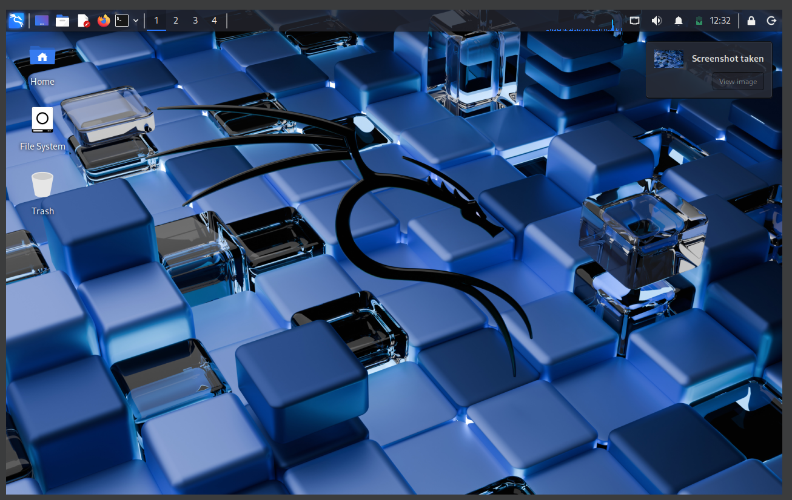

---
## Front matter
title: "Отчёт по индивидуальному проекту  №1"
subtitle: "Дисциплина: Основы информационной безопасности"
author: "Кузьмина Мария Константиновна"

## Pdf output format
toc: true # Table of contents
toc-depth: 2
lof: true # List of figures
fontsize: 12pt
linestretch: 1.5
papersize: a4
documentclass: scrreprt

## I18n polyglossia
polyglossia-lang:
  name: russian
  options:
    - spelling=modern
    - babelshorthands=true
polyglossia-otherlangs:
  name: english

## I18n babel
babel-lang: russian
babel-otherlangs: english

## Fonts
mainfont: Liberation Serif
sansfont: Liberation Sans
monofont: Liberation Mono
mathfont: Liberation Serif
mainfontoptions: Ligatures=Common,Ligatures=TeX,Scale=0.94
sansfontoptions: Ligatures=Common,Ligatures=TeX,Scale=MatchLowercase
monofontoptions: Scale=MatchLowercase

## Misc options
indent: true
header-includes:
  - \usepackage{indentfirst}
  - \usepackage{float}
  - \floatplacement{figure}{H}
  - \renewcommand{\contentsname}{Содержание}
  - \renewcommand{\listfigurename}{Список иллюстраций}
---

# Цель работы

Установка дистрибутива Kali Linux

# Задание

1. Установить Kali

# Выполнение 

## Скачать архив

Скачиваем и распаковываем архив (рис.1)

{width=90%}

## Запускаем машину

{width=100%}

## Заполняем данные

В полях "имя пользователя" "пароль" пишем  kali (рис.3)

{width=90%}

## Входим в систему

{width=90%}

# Вывод

Дистрибутив установлен
