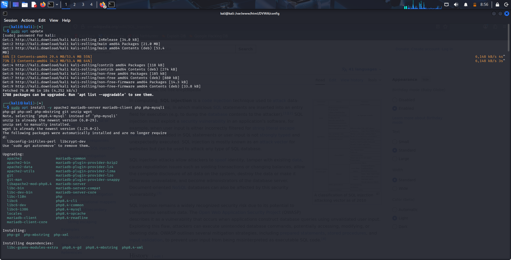
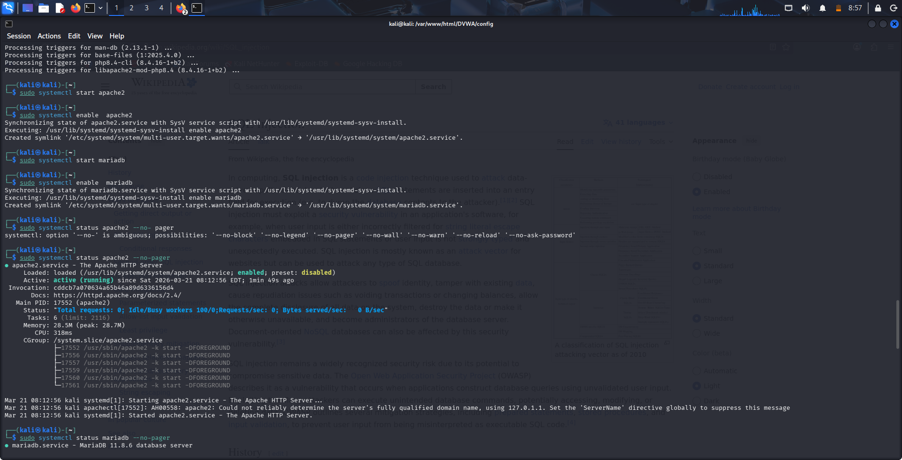
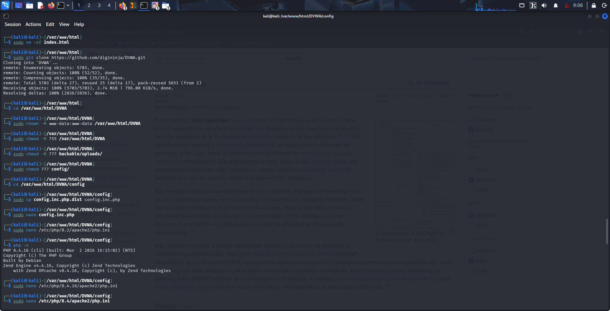
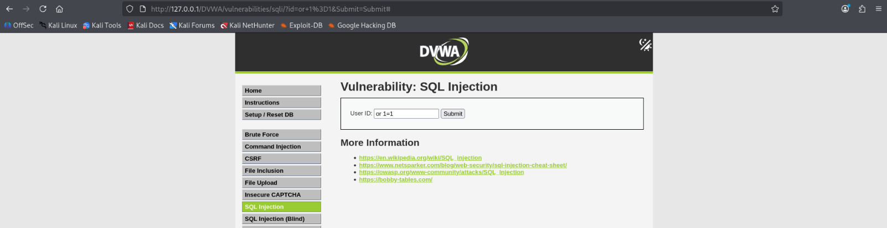

---
author:
  - name: "Кузьмина Мария Константиновна"
title: "Индивидуальный проект №2"
subtitle: "Основы информационной безопасности"
format: 
  revealjs:
    theme: simple
    transition: slide
    slide-number: true
    center: true
    chalkboard: true
    menu: true
  beamer:
    pdf-engine: lualatex
    aspectratio: 169
    slide-level: 2
    toc: false
    theme: default
    mainfont: "Liberation Serif"
    sansfont: "Liberation Sans"
    monofont: "Liberation Mono"
    header-includes:
      - \usepackage{fontspec}
      - \setmainfont{Liberation Serif}
      - \setsansfont{Liberation Sans}
      - \setmonofont{Liberation Mono}
---

## Цель работы

Установка DVWA

---

## Установка

Обновляем список пакетов, устанавливаем необходимые компоненты 

{width=100%}

---

## Запуск сервисов Apache и MySQL

Запускаем Apache, запускаем Mariadb(MySQL), проверяем, что оба сервиса работают 

{width=100%}

---

## Клонирование репозитория, настройка прав доступа, конфигурационного файла

Переходим в директорию /var/www/html/, клонируем репозиторий, устанавливаем правильные права. В редакторе  находим строки, отвечающие за подключение к базе данных данные, изменяем данные на те, которые указывали ранее (имя, пароль)

{width=100%}

---

## Инициализация DVWA через веб-интерфейс

Открываем браузер, переходим по ссылке http://127.0.0.1/DVWA/, входим с учетными данными по умолчанию, устанавливаем уровень безопасности (пока low), переходим в раздел 'SQL Injection', в поле вводим 'or 1=1', появляются ссылки на веб-страницы 

{width=100%}

---

## Выводы

Установка прошла успешно
